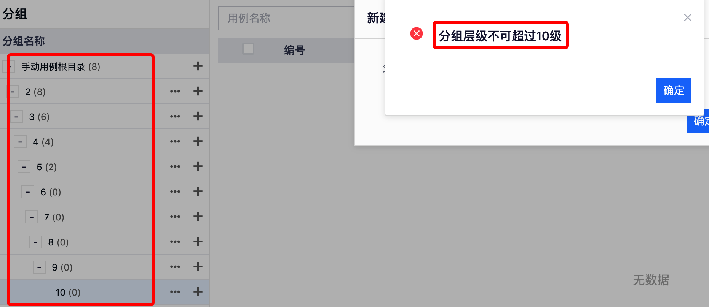
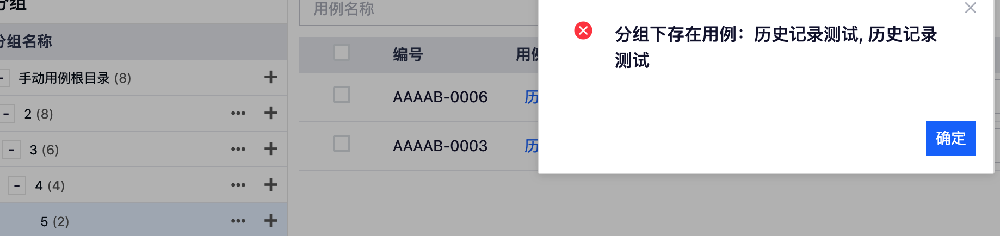
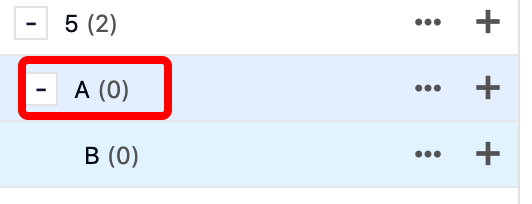
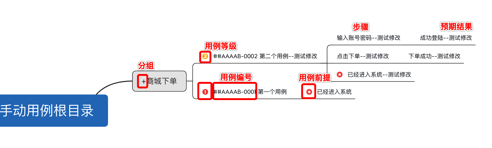
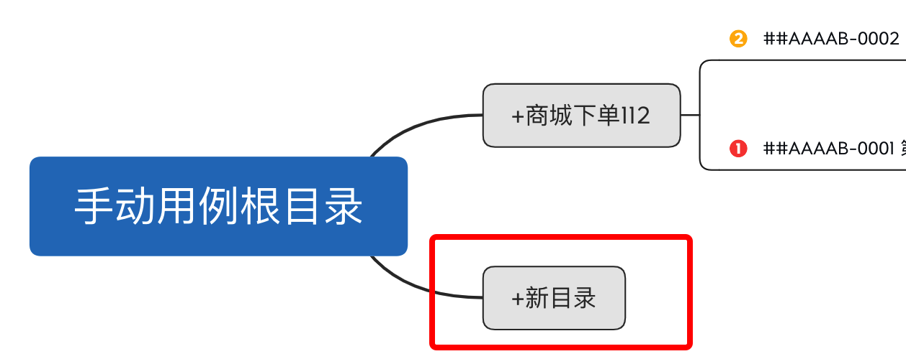
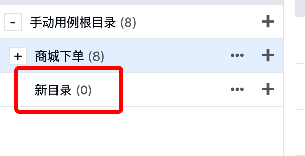
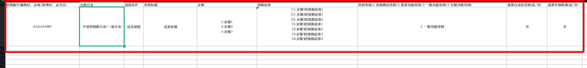
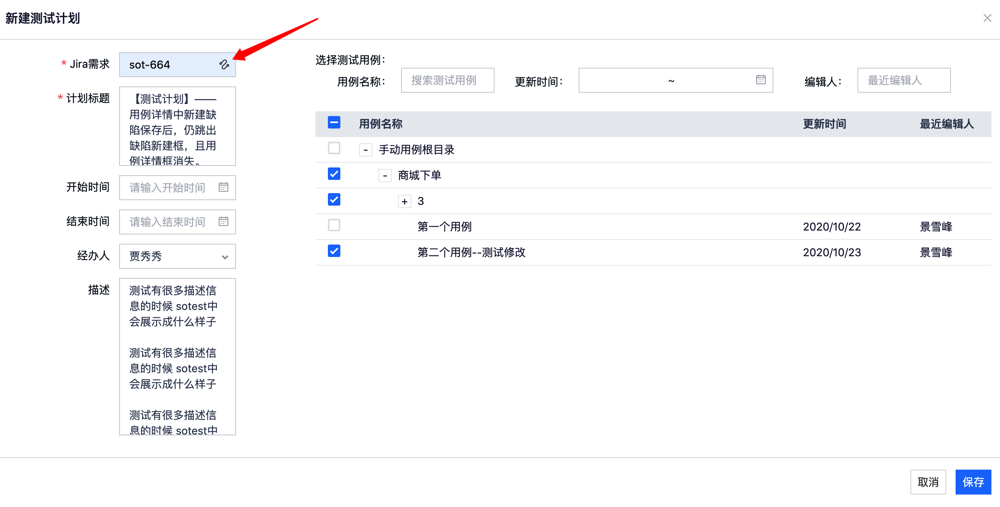

# 手工用例

## 用例管理工具

* 第一次进入用例库时，需要设置 项目的简称

  * 用例的唯一标示 = 项目简称 + 项目内的用例编号 
  * 整个系统中的文本输入限制都为255个字符

  

* 总共有三种形式来对用例库中的用例进行管理
  * 网页操作
  * xmind文件
  * excel文件

### 网页操作

##### 用例

（新建，修改，复制，废弃）

> 1. 废弃之后的用例，可以通过勾选“查看已废弃用例”看到。并且能够恢复。
>
>    （后续废弃用例需要写备注，注明废弃用例的原因是什么）

##### 分组

（新建，修改，删除）

> 1. 新建分组的时候，分组的层级不可以超过***10***级（含根目录）。
>
>    
>
>    
>
> 2. 根目录名称***不可以***修改
>
>    
>
> 3. 目录A下含有 用例 的时候，***目录A不可删除***
>
>    
>
> 
>
> （如果目录A下含有目录B，但是目录A，目录B下均没有用例。此时目录A可以直接删除）
>
> 

### xmind

##### 导出

（选择分组，导出该分组下的用例）

> 1. 实际导出xmind图例解读
>
>    
>
> 2. 可以选择多个分组，同时导出多个分组内的所有用例（后续支持：用例级别的导出）

##### 导入

（选择分组 必须 和导入的xmind的根节点相同）

> 1. 只有项目的管理员能通过导入xmind的方式新建分组
>
> 
>
>  
>
> 
>
> 
>
> 2. 用例编号
>
>    
>
>  
>
> 3. 任何形式的导入均 ***不会导致*** 用例或分组的删除
> 4. xmind暂时只支持导入单页签

### excel

##### 导出/导出 

（选择分组，导出该分组下的用例）

> excel模版解读
>
> 1. excel表头中 ***不能修改*** 括号外的文字
> 2. 用例编号：在新增用例时，必为空
> 3. 分级目录***（必填）***：需要以  /  符号作为分隔符。
> 4. 前提条件：无额外限制
> 5. 用例标题***（必填）***
> 6. 步骤：格式要求   ***(步骤编号 + 冒号)***  stepNum:     
> 7. 预期结果： 格式要求    ***(步骤编号+ 小数点 + 结果编号 + 冒号)***  stepNum.outcomeNum:    
> 8. 用例等级：内容中存在 阿拉伯数字 （1～4）
> 9. 需要自动化用例/需要外部联调：是/否 （默认为 否）

## 测试计划

### 对测试计划的管理

（新建，归档，编辑）

##### 新建测试计划

##### 编辑/归档测试计划

测试计划一旦归档，所有和当前测试计划相关的内容。全部锁定。且不可恢复。

### 计划--用例

（新增，操作用例的状态/经办人，从计划中删除用例）

* 只能新增 同项目下的 未被废弃的用例
* 用例内容会被同步更新

### 计划--缺陷

（新增，操作缺陷的状态/经办人）

### 计划--活动

活动在一个测试计划进行过程中，对关键事件有所记录

> 1. 添加测试用例到测试计划中
> 2. 更改测试用例经办人
> 3. 更改测试用例状态 (阻塞/未通过/通过)
> 4. 从测试计划中移除某个测试用例
> 5. 更改测试用例
> 6. 创建缺陷
> 7. 更改缺陷详情
> 8. 更改缺陷状态 (未修复/已修复/已废弃)

